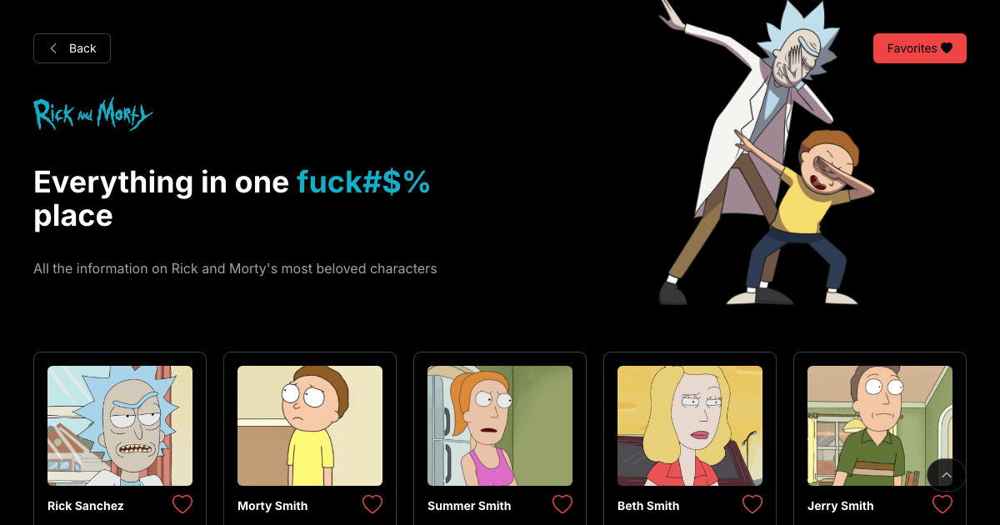

# Rick And Morty

Explore dimensões, personagens e episódios do multiverso de Rick e Morty 🌌🚀

## 🌍 Traduções

- [English](https://github.com/chrissgon/rickandmorty/blob/main/README.md)
- [Português Brasileiro](https://github.com/chrissgon/rickandmorty/blob/main/README-pt-BR.md)

## ⚠️ Requisitos

Este projeto utiliza [Bun](https://bun.sh/), e o lockfile é o `bun.lockb`. Também dá para usar o [Node](https://nodejs.org/en) com npm (`npm install`, `npm run build`), mas o npm não lê o `bun.lockb` e resolve as versões das dependências de novo.

## 🎨 Stack

- [React](https://react.dev/), [Redux Toolkit](https://redux-toolkit.js.org/) e [React Router](https://reactrouter.com/v6), com build pelo [Vite](https://vitejs.dev/).
- [Perfect UI](https://perfectui.dev) 1.0.0 nos componentes (cartões, botões, campos) e nas cores dos modos claro e escuro.
- [Tailwind CSS](https://tailwindcss.com/) 3 junto com a Perfect UI, para layout e espaçamento. O Preflight fica desligado e as cores apontam para os tokens `--pui-*` da Perfect UI, então os dois seguem o mesmo modo de cor (`tailwind.config.ts`).
- [Inter](https://rsms.me/inter/) hospedada no próprio projeto pelo `@fontsource-variable/inter`, sem pedido a CDN de fontes.
- [Bootstrap Icons](https://icons.getbootstrap.com/) também no próprio projeto: só os 17 ícones que o app usa, embutidos no CSS (`src/icons.css`). Para adicionar um, siga a nota no topo desse arquivo.
- O modo de cor fica salvo: escuro na primeira visita, e a escolha feita no botão de lua/sol vai para o cookie `pui-mode` e é aplicada antes de a página aparecer.
- Dados da [API pública de Rick and Morty](https://rickandmortyapi.com/).

## 📦 Instalação

- Clonar repositório.

```bash
git clone git@github.com:chrissgon/rickandmorty.git
```

## 🚀 Quick Start

- Instalar dependências.

```bash
bun install --frozen-lockfile
```

- Iniciar aplicação.

```bash
bun run dev
```

- Rodar o lint (falha com qualquer warning).

```bash
bun run lint
```

- Gerar o build de produção (checagem de tipos e depois o build do Vite em `dist/`) e servir esse build localmente.

```bash
bun run build
bun run preview
```

## 📝 Anotações

A aplicação fica em <a href="http://localhost:5173/">http://localhost:5173/</a> com `bun run dev`, e em <a href="http://localhost:4173/">http://localhost:4173/</a> com `bun run preview`.

## 🔗 Referências

- [Figma Design](<https://www.figma.com/file/1TK4NdE2NmVVz8tdz4CFso/Rick-and-Morty-(Community)>)
- [Perfect UI](https://perfectui.dev)
- [Redux JS](https://redux.js.org/introduction/getting-started)
- [React Router](https://reactrouter.com/v6)
- [React Course](https://www.youtube.com/playlist?list=PLpPqplz6dKxW5ZfERUPoYTtNUNvrEebAR)

## 💪🏻 Contribuição

Este projeto é de código aberto e recebe contribuições da comunidade. Sinta-se à vontade para fazer um fork, implementar melhorias e enviar uma pull request. Toda contribuição é valorizada e apreciada!

Sinta-se à vontade para explorar o código-fonte, fornecer feedback e relatar quaisquer problemas que encontrar.

## ❤️ Autores

- [@chrissgon](https://www.github.com/chrissgon)
