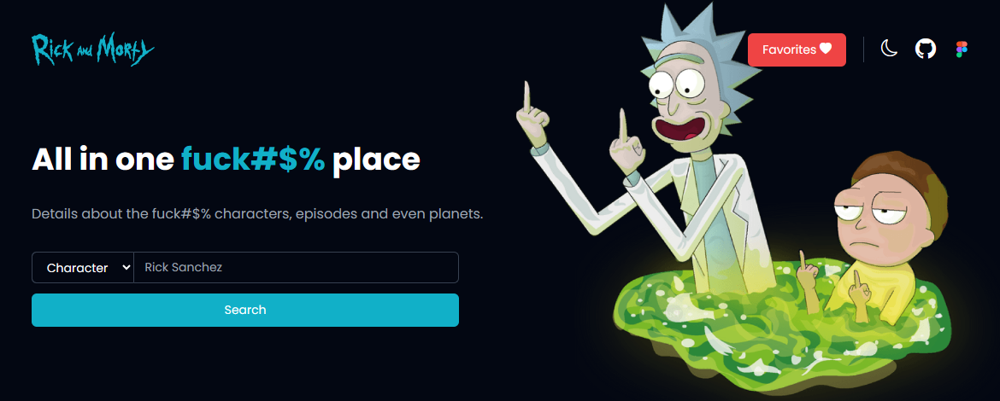

# Rick And Morty

Explore the multiverse of Rick and Morty with our comprehensive website, featuring episode guides, character bios, fan theories, and more!

## 🌍 Translations

- [English](https://github.com/chrissgon/rickandmorty/blob/main/README.md)
- [Português Brasileiro](https://github.com/chrissgon/rickandmorty/blob/main/README-pt-BR.md)

## ⚠️ Requirements

This project requires the ... installed.

## 📦 Install

- Clone the repository.

```bash
git clone git@github.com:chrissgon/rickandmorty.git
```

## 🚀 Quick Start

- Install dependencies.

```bash
npm i
```

- Run application.

```bash
npm run dev
```

## 📝 Anotations

Application hosted in <a href="http://localhost:5173/">http://localhost:5173/</a>.

## 🔗 References

- [Figma Design](<https://www.figma.com/file/1TK4NdE2NmVVz8tdz4CFso/Rick-and-Morty-(Community)>)
- [Redux JS](https://redux.js.org/introduction/getting-started)

## 💪🏻 Contribution

This project is open source and welcomes community contributions. Feel free to fork, implement improvements, and submit a pull request. Every contribution is valued and appreciated!

Feel free to explore the source code, provide feedback, and report any issues you encounter.

## ❤️ Authors

- [@chrissgon](https://www.github.com/chrissgon)
